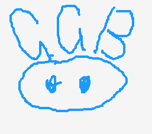

 

  

<h3 align="center"># GGB（猪猪侠）后端框架</h3>

  

    基于 gin 搭建的后端框架。
     
    Beauty and standards ✨
     
     
    ·
    <a href="https://github.com/wangyupo/GGB/issues">报告 Bug</a>
    ·
    <a href="https://github.com/wangyupo/GGB/issues">建议需求</a>
  

